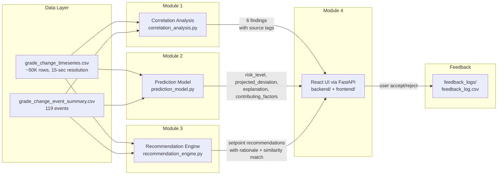

# Grade Change Intelligence System — Architecture

## System Block Diagram



```
┌──────────────────────────────────────────────────────────────────────────┐
│                          DATA LAYER                                       │
│  grade_change_timeseries.csv ─────┬──────────────────────────────────┐   │
│  grade_change_event_summary.csv ──┤                                  │   │
└───────────────────────────────────┼──────────────────────────────────┘   │
                                    │                                       │
        ┌───────────────────────────┼───────────────────────────┐          │
        │                           │                           │          │
        ▼                           ▼                           ▼          │
┌───────────────────┐   ┌───────────────────────┐   ┌──────────────────┐  │
│ CORRELATION       │   │ PREDICTION MODEL      │   │ RECOMMENDATION   │  │
│ ANALYSIS          │   │                       │   │ ENGINE           │  │
│                   │   │ • Random Forest (clf) │   │                  │  │
│ • Cross-corr     │   │ • Gradient Boost (reg)│   │ • KNN recovery   │  │
│ • Pearson r       │   │ • Event-based split   │   │   library (344)  │  │
│ • Grade-pair stats│   │ • 22 features         │   │ • Recipe limits  │  │
│                   │   │                       │   │                  │  │
│ Output: 6 findings│   │ Output: risk_level,   │   │ Output: setpoint │  │
│ with source tags  │   │ projected deviation,  │   │ changes, source  │  │
│                   │   │ explanation, factors   │   │ tag, similarity  │  │
└────────┬──────────┘   └───────────┬───────────┘   └────────┬─────────┘  │
         │                          │                         │            │
         └──────────────────────────┼─────────────────────────┘            │
                                    │                                       │
                                    ▼                                       │
                    ┌───────────────────────────────┐                       │
                    │  FASTAPI  +  REACT UI         │                       │
                    │                               │                       │
                    │ • Live Monitor (risk, charts) │                       │
                    │ • Correlation Analysis        │                       │
                    │ • Historical Events           │                       │
                    │ • Feedback Log                │                       │
                    └──────────────┬────────────────┘                       │
                                   │                                        │
                                   ▼                                        │
                    ┌───────────────────────────────┐                       │
                    │  FEEDBACK LOG (CSV)           │                       │
                    │  accept/reject decisions      │                       │
                    └───────────────────────────────┘                       │
```

---

## Module Descriptions

### Module 1: Correlation Analysis (`modules/correlation_analysis.py`)

**What it does:** Mines the full historical dataset to discover which process variables and patterns predict bad (slow-to-stabilize or high-deviation) grade-change transitions.

**Inputs:**
- `grade_change_timeseries.csv` — 15-second resolution process data across 119 events
- `grade_change_event_summary.csv` — per-event outcome metrics

**Outputs:** 6 correlation findings, each containing:
- Correlation strength (Pearson r) and p-value
- Plain-language description and actionable recommendation
- Impact level (HIGH/MEDIUM)
- Source tag (e.g., "Historical timeseries cross-correlation analysis")
- Variables involved

**Key Findings:**
1. Steam Pressure → Moisture time lag (~66s) — HIGH impact
2. Filler Flow Drift → Ash Deviation (r=0.549) — MEDIUM
3. Operator Interventions → Longer Stabilization (r=0.769) — HIGH
4. Early Filler Flow Volatility → Slow Stabilization — MEDIUM
5. Machine Speed Ramp Rate → Stabilization Time — MEDIUM
6. Grade-Pair Transition Difficulty (C→A hardest) — HIGH

---

### Module 2: Prediction Model (`modules/prediction_model.py`)

**What it does:** Watches an in-progress grade-change transition and flags rising risk of exceeding the 2.5% Basis Weight deviation threshold before it happens.

**Inputs:**
- Current process state (all sensor readings at time t)
- Recent history window (~2 minutes / 9 samples)
- Trained model weights (Random Forest classifier + Gradient Boosting regressor)

**Outputs:**
- `risk_level`: LOW / MEDIUM / HIGH / CRITICAL
- `risk_probability`: 0.0–1.0 (probability of exceeding 2.5% in next 60s)
- `projected_deviation_pct`: predicted max deviation in next 60s
- `time_to_breach_sec`: estimated seconds until threshold crossed
- `explanation`: plain-language text describing the risk assessment
- `contributing_factors`: top 5 features driving the prediction
- `source`: inference method tag

**Training approach:**
- 22 rolling features (current state + rates + volatility + grade encoding + trend)
- Event-based train/test split: 89 train / 30 test events (no data leakage)
- Classifier: `RandomForestClassifier(n_estimators=150, max_depth=12, class_weight="balanced")`
- Regressor: `GradientBoostingRegressor(n_estimators=150, max_depth=6)`

---

### Module 3: Recommendation Engine (`modules/recommendation_engine.py`)

**What it does:** When risk is flagged, suggests specific setpoint adjustments matched from similar historical transitions that recovered fastest. Also enforces recipe limits per grade.

**Inputs:**
- Current process state
- Risk prediction from Module 2
- Recovery library (344 historical recovery patterns)
- Recipe limits per grade (derived from steady-state operating ranges)

**Outputs:**
- Recommended setpoint changes for: stock_flow, steam_pressure, filler_flow, machine_speed
- Each recommendation includes: current → suggested value, delta, rationale text, similarity match %, source tag
- Recipe limit violations flagged if a suggestion would exceed safe operating range

**Approach:**
- KNN similarity search (k=5, StandardScaler + Euclidean distance) over recovery library
- Weighted averaging of setpoint changes from nearest neighbors (faster recoveries get more weight)
- Confidence computed from: direction agreement (45%) + magnitude consistency (35%) + proximity (20%)
- Fallback: rule-based process knowledge when no similar patterns found

---

### Module 4: Operator Interface (`backend/` FastAPI + `frontend/` React)

**What it does:** Exposes the three model modules over a REST API and renders them
as a DCS-style operator console. No prediction, scoring, projection or
recommendation logic is reimplemented in TypeScript — the browser formats and
draws what Python returns.

**Displays:**
1. **Live Monitor** — Event selector, simulation time slider, risk level, current & projected deviation, BW/deviation strip charts, future-state projection, recipe-limit table, recommendation cards with Accept/Reject
2. **Correlations** — All 6 findings with detail, feature importance ranking, high-impact parameters
3. **Historical Events** — Scatter of all 119 events, per-event detail, operator action log, optimal setpoints
4. **Feedback Log** — Decision history with acceptance rate statistics, CSV export
5. **Settings** — Scoped resets for display cache, session decisions, API memoisation and the feedback log

**Data flow per interaction:**
1. Operator selects an event + simulation time in the browser
2. React calls `GET /api/events/{id}/predict?t=` and `.../recommendations?t=`
3. `services.py` slices the timeseries up to time `t` and calls `PredictionModel.predict_risk()` and `RecommendationEngine.recommend()` on the warm model objects
4. JSON-safe results render as risk cards, explanation text and suggestion cards
5. Accept/Reject posts to `POST /api/feedback` → `FeedbackLogger.log_decision()` writes to CSV

Models are loaded once at API startup, so requests are served from warm objects
rather than retraining per call. Fitting the estimators is the expensive part
(~22 of the ~25 startup seconds) and depends only on the CSVs, so the container
build runs `scripts/build_model_cache.py` and startup reloads the fitted objects
from `artifacts/model_cache.joblib` in ~0.3 s instead. The artifact is keyed to
the datasets, the files in `modules/` and the library versions that pickled the
estimators; on any mismatch the API trains as before, so the cache can change
startup time but never the predictions. `/api/health` reports which path ran.

---

## How to Run

### Prerequisites
- Python 3.12+ and Node.js 20+

### Backend (port 8000) — start first
```bash
python3 -m venv .venv && source .venv/bin/activate
pip install -r backend/requirements.txt
cd backend && uvicorn main:app --port 8000
```
Wait for `Models ready (...). 119 events, 344 recovery patterns.`

### Frontend (port 5173)
```bash
cd frontend && npm install && npm run dev
```
Open http://localhost:5173 in your browser. Vite proxies `/api` to port 8000.

### Or one container
```bash
docker build -t grade-change-intelligence . && docker run -p 8000:8000 grade-change-intelligence
```
Open http://localhost:8000 — FastAPI serves the API and the compiled UI together.

### Run Evaluation Report (optional)
```bash
python3 scripts/evaluation_report.py
```
Prints a full comparison of old (leaked) vs new (honest) model metrics.

### Run Individual Modules (testing)
```bash
python3 -m modules.correlation_analysis
python3 -m modules.prediction_model
python3 -m modules.recommendation_engine
```

---

## Validation Summary

### Data Leakage Fix

The original model reported 98% accuracy by splitting 20K+ sliding-window samples randomly by row. Since consecutive 15-second snapshots from the same event are nearly identical, this inflated metrics via data leakage.

**Fix:** Split by `grade_change_event_id` — all samples from held-out events go exclusively into the test set.

### Honest Metrics (Event-Based Holdout)

| Metric | Value | Context |
|--------|-------|---------|
| **Split** | 89 train / 30 test events | Reproducible (seed=42) |
| **Accuracy** | 94.5% | Baseline (majority class): 78.1% |
| **Precision** | 83.9% | Of predicted breaches, 84% were real |
| **Recall** | 92.8% | Catches 93% of actual breaches |
| **F1 Score** | 88.1% | Harmonic mean of precision & recall |
| **Regressor R²** | 0.985 | Deviation magnitude prediction |
| **MAE** | 0.283% | Average error in projected deviation |
| **RMSE** | 0.447% | Root mean squared error |
| **Lead Time** | ~16.5s | Early warning before threshold crossing |
| **Train-Test Gap** | 4.0pp | Minimal overfitting |

### Class Balance
- Target: "Will deviation exceed 2.5% in next 60 seconds?"
- Positive rate: ~20% (breach) / ~80% (no breach)
- Model adds +16.4 percentage points above naive baseline

### Key Conclusion
The model genuinely generalizes to unseen grade-change events — it learned real process dynamics (steam-moisture lag, deviation momentum, volatility patterns), not just memorized history.

---

## File Structure

```
grade-change-intelligence/
├── README.md                           # Project overview & quickstart
├── Dockerfile                          # Multi-stage build: UI bundle + API in one image
├── backend/                            # Module 4a: FastAPI wrapper (no model logic)
│   ├── main.py                         # Entry point (uvicorn main:app)
│   ├── requirements.txt                # Web layer + pinned ML stack
│   └── gci_api/                        # App factory, routes, services, serialization
├── frontend/                           # Module 4b: React + TypeScript + Vite console
│   ├── package.json                    # UI dependencies
│   └── src/                            # lib/ store/ components/ pages/
├── modules/
│   ├── __init__.py
│   ├── correlation_analysis.py         # Module 1: correlation discovery
│   ├── prediction_model.py             # Module 2: ML risk prediction
│   ├── recommendation_engine.py        # Module 3: KNN recommendations
│   └── recipe_limits.py                # Grade recipe constraint tables
├── data/
│   ├── grade_change_timeseries.csv     # Raw timeseries (~50K rows)
│   └── grade_change_event_summary.csv  # Event summaries (119 events)
├── scripts/
│   ├── generate_grade_change_data.py   # Synthetic data generator
│   └── evaluation_report.py            # Prints old vs new metrics comparison
├── docs/
│   ├── ARCHITECTURE.md                 # This document
│   └── DOCUMENTATION.md                # Extended documentation
└── feedback_logs/                      # Operator decision log (created at runtime)
```
